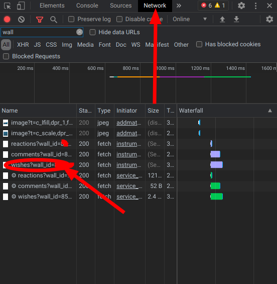

# Spamdlet
This is a simple Padlet spam script written in Python.
# How to use this script?
(For the script to work, you need to install requests by entering **pip3 install requests** in the terminal).

When you run the script, you will need wall_id, as well as a link to the attachment that you will spam.
# How do I find out the wall_id and wall_section_id?
You need to use the **developer tools** by pressing **F12** on the keyboard (before that you need to go to the padlet you need).

Then you go to the **Networks** tab and refresh the page.

Then you will see that a file with the name **wishes** appears in the tab, by clicking on which you will find **wall_id**. If you can't find it you can search for **wall_id**

# Firefox

# Chromium based

> All actions were performed in **Firefox** and **Chromium** the process may be different in other browsers.

> The script works only when the objects are arranged in columns in the padlet you need
